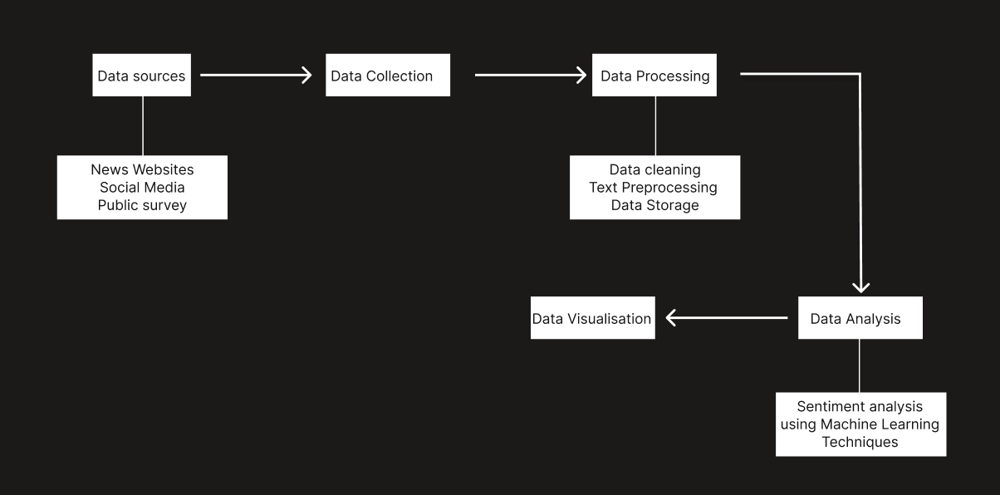

# Sentiment Analysis of Western Media Coverage on India

## Table of Contents
1. [Project Overview](#project-overview)
2. [Problem Statement](#problem-statement)
3. [System Architecture](#system-architecture)
4. [Tools and Technologies](#tools-and-technologies)
5. [Dataset Description](#dataset-description)
6. [Data Format](#data-format)
7. [Data Processing](#data-processing)
8. [Analysis Approach](#analysis-approach)
9. [Expected Outcomes](#expected-outcomes)
10. [Installation and Usage](#installation-and-usage)
11. [Contributing](#contributing)
12. [License](#license)

## Project Overview

This project aims to conduct a comprehensive sentiment analysis of Western media coverage about India. Utilizing natural language processing (NLP) techniques and machine learning algorithms, we aim to uncover trends, patterns, and biases in the sentiment of news articles from prominent Western media outlets.

## Problem Statement

In today's globalized world, media coverage significantly influences public perception and international relations. This project seeks to analyze the sentiment of Western media coverage about India, focusing on:

- Collecting and preprocessing a large dataset of news articles.
- Developing a sentiment analysis model to classify the sentiment of these articles.
- Analyzing the sentiment data to uncover trends, differences between media outlets, and biases.
- Providing visualizations and reports summarizing the findings.

## System Architecture



## Tools and Technologies

### Data Collection Tools
- **Web Scrapers**: 
  - BeautifulSoup
  - Scrapy
- **API Integrations**:
  - Tweepy (Twitter API)
  - Facebook Graph API
  - PRAW (Python Reddit API Wrapper)

### Data Processing Tools
- **Data Cleaning**:
  - Pandas
  - OpenRefine
- **Text Preprocessing**:
  - NLTK
  - SpaCy

### Analysis Tools
- **Sentiment Analysis**:
  - VADER
  - TextBlob
  - BERT
- **Comparative Analysis**:
  - Pandas & NumPy
  - SciPy

### Visualization & Reporting Tools
- **Dashboards**:
  - Tableau
  - Power BI
- **Reports**:
  - Jupyter Notebooks
  - LaTeX
- **Custom Visuals**:
  - Matplotlib
  - Seaborn

## Dataset Description

### News Articles
- **Sources**:
  - UK Media: BBC, The Guardian, The Times, Financial Times, The Telegraph
  - USA Media: CNN, The New York Times, Washington Post, The Wall Street Journal, NBC News
- **Data Points**:
  - Article Title
  - Publication Date
  - Author
  - Source
  - Full Text
  - URL
  - Metadata
- **Collection Method**:
  - Web Scraping
  - APIs

### Social Media Posts
- **Sources**:
  - Twitter
  - Facebook
  - Reddit
- **Data Points**:
  - Post Content
  - Username
  - Timestamp
  - Platform
  - Engagement Metrics
  - Location
  - URL
- **Collection Method**:
  - APIs

## Data Format

### News Articles
| Field            | Data Type | Description                                    |
|------------------|-----------|------------------------------------------------|
| News Agency Name | String    | Name of the news agency (e.g., BBC, CNN)       |
| Title            | String    | Title of the news article                      |
| Date             | Date      | Date of publication (format: YYYY-MM-DD)       |
| Author           | String    | Author of the article                          |
| Source           | String    | URL or source reference                        |
| Full Text        | Text      | Full text of the news article                  |
| URL              | String    | Web address of the article                     |
| Metadata         | JSON      | Additional metadata related to the article     |

### Social Media Posts
| Field            | Data Type | Description                                    |
|------------------|-----------|------------------------------------------------|
| Post Content     | Text      | Content of the social media post               |
| Username         | String    | Username of the poster                         |
| Timestamp        | DateTime  | Date and time of the post (format: YYYY-MM-DD HH:MM:SS) |
| Platform         | String    | Social media platform (e.g., Twitter, Facebook)|
| Engagement Metrics | JSON   | Metrics like likes, shares, comments           |
| Location         | String    | Location of the user (if available)            |
| URL              | String    | Web address of the post                        |

## Data Processing

1. **Collection**: Using web scraping and APIs to gather data from specified sources.
2. **Cleaning**: Removing duplicates, irrelevant information, and handling missing values.
3. **Text Preprocessing**:
   - Tokenization
   - Stopwords Removal
   - Lemmatization/Stemming
   - Normalization

## Analysis Approach

### Type of Analysis
1. **Comparative Analysis**: Comparing sentiment across different media sources, platforms, and time periods.
2. **Trend Analysis**: Identifying trends and patterns in sentiment over time or in response to specific events or topics.
3. **Geographical Analysis**: Analyzing sentiment variations between the UK and USA media.

### Comparative Analysis
- **Statistical Tests**: Conduct statistical tests to compare sentiment distributions.
- **Visualization**: Use visualizations such as box plots, histograms, and bar charts.

### Trend Analysis
- **Time-Series Analysis**: Analyze sentiment trends over time.
- **Topic Modeling**: Identify dominant topics and their associated sentiment over time.

### Geographical Analysis
- **Geospatial Visualization**: Map sentiment scores to visualize regional variations.
- **Statistical Analysis**: Perform statistical tests to compare sentiment between regions.

## Expected Outcomes

The project aims to provide insights into how India is portrayed in Western media, identify potential biases, and offer a foundation for further research in media studies and sentiment analysis.

## Installation and Usage

### Prerequisites
- Python 3.8+
- Pip

### Installation
1. Clone the repository:
   ```sh
   git clone https://github.com/aryamanpathak2022/Sentimental_analysis_wn.git
   cd Sentimental_analysis_wn
   ```
2. Install the required packages:
   ```sh
   pip install -r requirements.txt
   ```

### Usage
1. Data Collection:
   ```sh
   python collect_data.py
   ```
2. Data Preprocessing:
   ```sh
   python preprocess_data.py
   ```
3. Sentiment Analysis:
   ```sh
   python analyze_sentiment.py
   ```
4. Generate Reports:
   ```sh
   python generate_reports.py
   ```

## Contributing

Contributions are welcome! Please read the [CONTRIBUTING.md](CONTRIBUTING.md) for details on the process for submitting pull requests.

## License

This project is licensed under the MIT License - see the [LICENSE](LICENSE) file for details.
