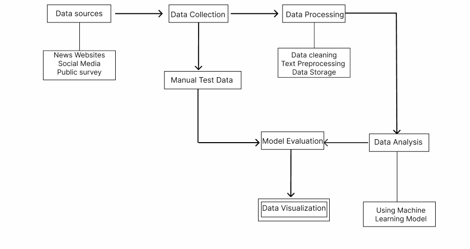
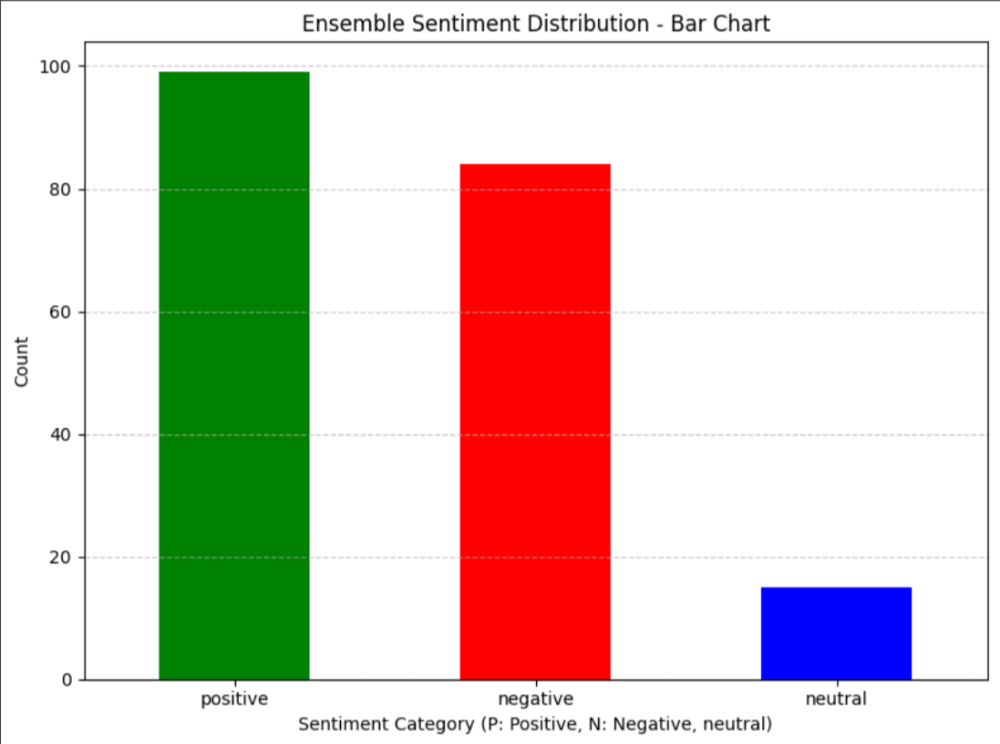
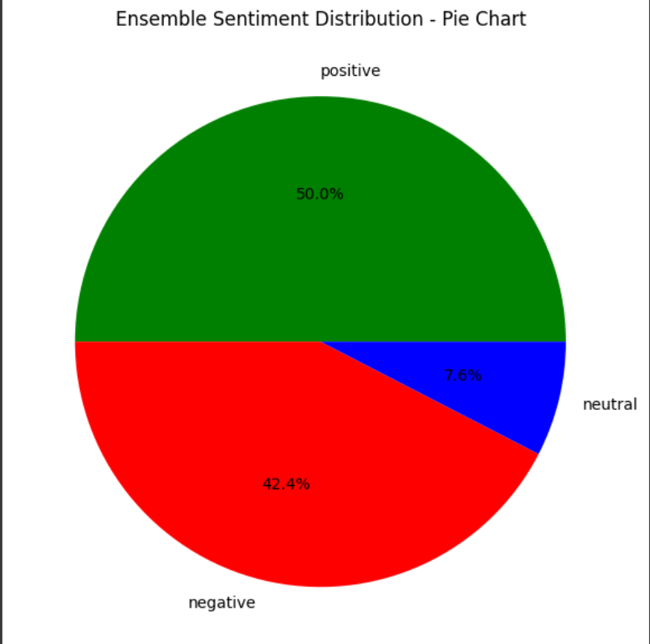
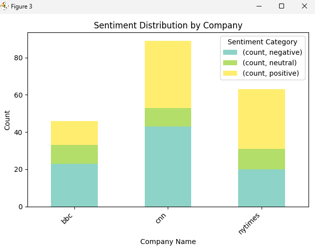
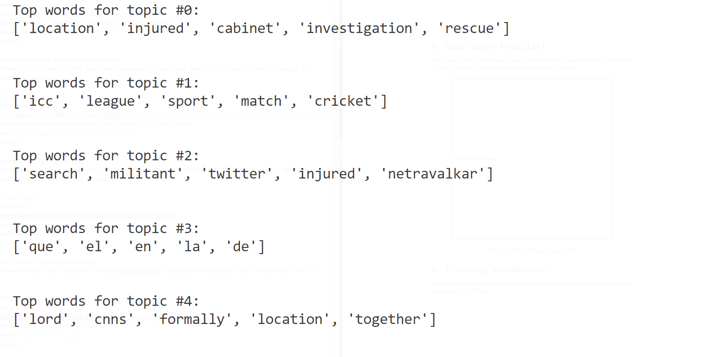
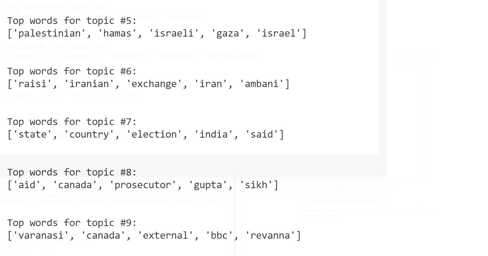
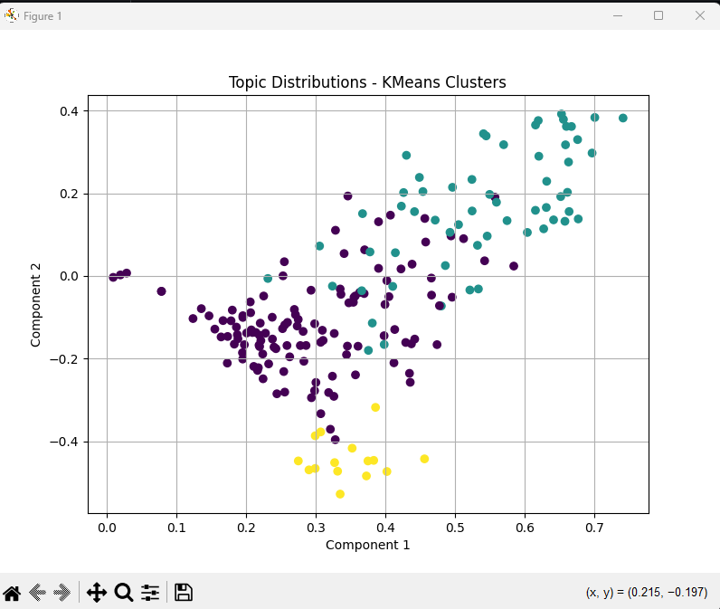

# Project Goals and Plan

## Table of Contents
- [Problem Statement](#problem-statement)
- [System Model / Architecture](#system-model--architecture)
  - [Data Sources](#data-sources)
  - [Data Collection](#data-collection)
  - [Data Processing](#data-processing)
  - [Manual Test Data](#manual-test-data)
  - [Data Analysis](#data-analysis)
  - [Model Evaluation](#model-evaluation)
  - [Data Visualization](#data-visualization)
- [Description of Tools](#description-of-tools)
  - [Data Collection Tools](#data-collection-tools)
  - [Data Processing Tools](#data-processing-tools)
  - [Analysis Tools](#analysis-tools)
  - [Visualization & Reporting Tools](#visualization--reporting-tools)
- [Dataset](#dataset)
- [Analysis and Expected Outcome](#analysis-and-expected-outcome)

## Problem Statement

**Sentiment Analysis of Western Media Coverage on India**

In today's globalized world, media coverage plays a crucial role in shaping public perception and opinion. The portrayal of countries and their events in foreign media can significantly influence international relations, tourism, investment, and public sentiment. India, as one of the world's largest democracies and rapidly growing economies, frequently features in Western media. However, the sentiment of this coverage—whether positive, neutral, or negative—can vary widely.

Despite the importance of understanding these portrayals, there is a lack of comprehensive analysis focused on the sentiment of Western media coverage about India. This project aims to fill this gap by conducting a detailed sentiment analysis on a large dataset of news articles from prominent Western media outlets. By leveraging natural language processing (NLP) techniques and machine learning algorithms, the project will identify trends, patterns, and biases in the sentiment of this coverage.

The main objectives of the project are:

- To collect and preprocess a substantial dataset of news articles about India from Western media sources.
- To analyze the sentiment data to uncover trends over time, differences between media outlets, and potential biases in coverage.
- To provide visualizations and reports summarizing the findings, which can be valuable for policymakers, researchers, and the general public.

The insights gained from this project will contribute to a better understanding of how India is portrayed in Western media and can help in addressing any identified biases or misinformation. It will also provide a foundation for further research in the field of media studies and sentiment analysis.

## System Model / Architecture

### Data Sources

**Objective:** Identify and list the sources from where the data will be collected.

**Description:**
- **News Websites:** We will identify major news outlets like BBC, CNN, The New York Times, and The Guardian. These sources are known for their comprehensive news coverage and diverse viewpoints.

### Data Collection

**Objective:** Gather the data from the identified sources.

**Description:**
- **Web Scraping:** Develop and run automated scripts to extract articles, headlines, and comments from news websites. We will parse HTML content to extract relevant text data.
- **API Requests:** Use API calls to fetch data from social media platforms and news aggregators. This includes setting up authentication, constructing queries, and handling API responses.
- **Database Storage:** Store the collected data in a structured format using databases. This involves designing a schema, setting up the database, and ensuring data integrity and efficiency.

### Data Processing

**Objective:** Clean and preprocess the collected data for analysis.

**Description:**
- **Text Cleaning:** Remove unwanted elements from the text such as HTML tags, punctuation, special characters, and stop words. This step is crucial for preparing the data for analysis.
- **Normalization:** Standardize the text by converting it to lowercase, and applying stemming and lemmatization to reduce words to their base forms.
- **Tokenization:** Split the cleaned text into individual words or phrases (tokens) to facilitate further analysis.

### Manual Test Data

**Objective:** Create a labeled dataset for model evaluation.

**Description:**
- **Manual Annotation:** A subset of the collected data will be manually labeled by human annotators. This involves reading each text and assigning sentiment labels such as positive, negative, or neutral.
- **Guidelines:** Develop clear and consistent guidelines for annotators to follow, ensuring uniformity in the labeling process. This may include examples and detailed instructions on how to handle ambiguous cases.

### Data Analysis

**Objective:** Analyze the processed data to extract meaningful insights.

**Description:**
- **Sentiment Analysis:** Apply different sentiment analysis models to the processed data.
- **Sentiment Distribution:** Analyze the distribution of different sentiments (positive, negative, neutral) across the dataset. This helps in understanding the overall mood and sentiment trends.

### Model Evaluation

**Objective:** Evaluate different sentiment analysis models to choose the best one.

**Description:**
- **Model Testing:** Evaluate the trained models on the manually labeled test data to measure their performance. This step ensures that the models are assessed on a real-world dataset.
- **Accuracy Measurement:** Use metrics such as accuracy, precision, recall, and F1-score to evaluate model performance. Additionally, we will use a confusion matrix and ROC curve to gain deeper insights into the model's predictive capabilities.

### Data Visualization

**Objective:** Visualize the analysis results and model performance.

**Description:**
- **Sentiment Trends:** Create visualizations to show sentiment trends over time. This might include line graphs and area charts to illustrate changes in sentiment.

## Description of Tools

### Data Collection Tools

#### Web Scrapers:
- **BeautifulSoup:** A Python library used for parsing HTML and XML documents. It creates parse trees from page source code that can be used to extract data easily.
- **Scrapy:** An open-source and collaborative web crawling framework for Python. It's used to extract data from websites and can handle large-scale scraping operations.

### Data Processing Tools

#### Text Preprocessing:
- **NLTK (Natural Language Toolkit):** A suite of libraries and programs for symbolic and statistical natural language processing (NLP) for English written in Python. It includes libraries for tokenization, stemming, and more.

### Analysis Tools

#### Sentiment Analysis:
- **VADER (Valence Aware Dictionary and sEntiment Reasoner):** A lexicon and rule-based sentiment analysis tool specifically attuned to sentiments expressed in social media.
- **TextBlob:** A Python library for processing textual data. It provides a simple API for diving into common NLP tasks such as part-of-speech tagging, noun phrase extraction, sentiment analysis, classification, and translation.
- **BERT (Bidirectional Encoder Representations from Transformers):** A transformer-based machine learning technique for NLP pre-training. It's used for tasks like sentiment analysis and can be fine-tuned with specific data.

### Visualization & Reporting Tools

#### Dashboards:
- **Tableau:** A powerful data visualization tool used for converting raw data into an understandable format. It is used to create interactive and shareable dashboards.
- **Power BI:** A business analytics service by Microsoft that provides interactive visualizations and business intelligence capabilities with an interface simple enough for end users to create their own reports and dashboards.

#### Reports:
- **Jupyter Notebooks:** An open-source web application that allows you to create and share documents that contain live code, equations, visualizations, and narrative text. It's used for data cleaning, transformation, analysis, and visualization.
- **LaTeX:** A typesetting system commonly used for technical and scientific documentation.

#### Custom Visuals:
- **Matplotlib:** A plotting library for the Python programming language and its numerical mathematics extension NumPy. It provides an object-oriented API for embedding plots into applications.
- **Seaborn:** A Python data visualization library based on Matplotlib. It provides a high-level interface for drawing attractive statistical graphics.

## Dataset

The dataset for this project will consist of multiple types of data sources, each contributing unique insights into how India is covered and perceived in the Western media, specifically focusing on the UK and USA. Below is a detailed description of the dataset components:

### News Articles

#### Sources:
- **UK Media:** BBC, The Guardian, The Times, Financial Times, The Telegraph.
- **USA Media:** CNN, The New York Times, Washington Post, The Wall Street Journal, NBC News.

#### Data Points:
| Data Point     | Description                           |
| -------------- | ------------------------------------- |
| News Agency    | The name of the news outlet (e.g., BBC, CNN) |
| Title          | The headline of the news article      |
| Article        | The complete text of the article      |
| Date           | Date when the article was published   |
| URL            | The link to the original article      |

#### Collection Method:
- **Web Scraping:** Use Scrapy to scrape articles from the websites of the specified news sources.
- **APIs:** Where available, use news APIs to collect articles.

## Overall Sentiment Distribution

The overall sentiment distribution in the dataset is visualized in the bar chart and pie chart below.

## Company-wise Sentiment Analysis

The sentiment distribution for each news company is analyzed and visualized in the following bar charts and pie charts.

## Main Topics Using LDA

The main topics in the dataset were identified using Latent Dirichlet Allocation (LDA). The word clouds below illustrate the key topics.

## Clustering Visualization

The sentiment data was clustered using dimensionality reduction techniques and visualized in a 2D plot using Kmeans.

## Methods and Tools Used

This analysis utilized an ensemble method combining the sentiment analysis tools VADER, TextBlob, and Flair to achieve robust sentiment classification. 

### VADER

The VADER (Valence Aware Dictionary and sEntiment Reasoner) tool is a lexicon and rule-based sentiment analysis tool specifically attuned to sentiments expressed in social media.

### TextBlob

TextBlob is a simple Python library for processing textual data, providing a consistent API for diving into common natural language processing (NLP) tasks.

### Flair

Flair is a powerful NLP library developed by Zalando Research, capable of performing a wide range of NLP tasks, including named entity recognition (NER), part-of-speech tagging (POS), and sentiment analysis.

## Data Source

The dataset used in this analysis is available for download [here](https://www.kaggle.com/datasets/aryamanpathak/western-news-about-india/). It consists of news articles from various Western media outlets, categorized by company.
